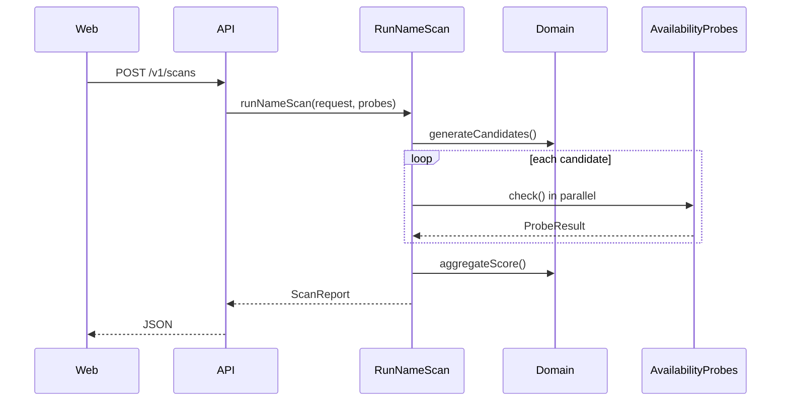

# NameScanner Architecture

NameScanner is a **probe-orchestration engine** for evaluating business name candidates. External systems (domain registries, search APIs, social platforms) are accessed only through adapters. Business rules live in `domain`. HTTP and UI are thin delivery layers.

## Goals

- **Modularity:** add a probe without rewriting orchestration or scoring
- **Low latency:** parallel probes with per-adapter timeouts
- **Honest failures:** partial results beat silent errors
- **Portfolio clarity:** structure readable by a senior engineer in 10 minutes

## Package boundaries

| Package | Responsibility | May depend on |
|---|---|---|
| `@namescanner/contracts` | Zod API schemas, shared DTOs | `zod` only |
| `@namescanner/domain` | Pure business logic (generation, scoring) | nothing internal |
| `@namescanner/application` | Use cases + port interfaces | `domain`, `contracts` |
| `@namescanner/config` | Typed environment parsing | `zod` |
| `@namescanner/adapters-stub` | Simulated probes (dev/test; `PROBE_MODE=stub`) | `application`, `domain` |
| `@namescanner/adapters-rdap` | Real domain checks via public RDAP (`PROBE_MODE=live`) | `application`, `domain` |
| `@namescanner/adapters-namecheap` | Registrar catalog pricing (`DomainPricingProvider`) | `application`, `contracts` |
| `@namescanner/adapters-brave` | Web collision via Brave Search (`PROBE_MODE=live`) | `application`, `domain` |
| `@namescanner/adapters-github` | GitHub user/org handle checks (`PROBE_MODE=live`) | `application`, `domain` |
| `@namescanner/adapters-godaddy` | GoDaddy domain availability + per-name pricing | `application`, `domain` |
| `@namescanner/adapters-*` | Other external integrations | `application`, `contracts` |
| `@namescanner/api` | Hono transport, DI wiring | `application`, `contracts`, `config` |
| `@namescanner/web` | React UI | API over HTTP only |

**Rule:** `domain` never imports from `application`, `api`, or adapters.

## Request flow (target state)

## Probe contract

Every adapter implements `AvailabilityProbe`:

- `supports(context)` — e.g. skip Brave when API key missing
- `check(candidate, context)` — returns normalized `ProbeResult`

`ProbeResult` is identical across providers. Adapters map foreign responses into this shape.

## Session roadmap

| Session | Deliverable |
|---|---|
| 1 | Monorepo scaffold, contracts, ports, ADRs |
| 2 | Scoring, probe timeouts, stub adapters, composition root |
| 3 | RDAP domain adapter (live mode) |
| 4 | Registrar pricing adapter (stub + Namecheap) |
| 5 | Brave + GitHub + India link adapters |
| 6 | OpenAPI spec |
| 7 | Web UI |
| 8 | Deploy docs + optional MCP |

## Adding a new probe

1. Create `packages/adapters-<name>/`
2. Implement `AvailabilityProbe`
3. Register in `apps/api/src/composition.ts` (Session 7)
4. Add contract test fixtures under `packages/adapters-<name>/fixtures/`
5. Document env vars in `.env.example`
